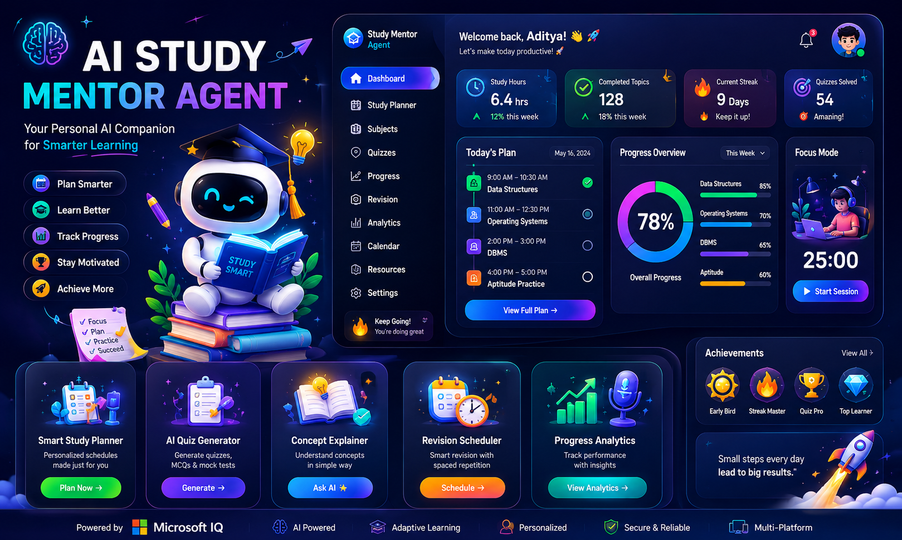

# 🎓 AI Study Mentor Agent

<p align="center">
  
  
  
  
  
</p>

<p align="center">
  
  
  
  
</p>

<p align="center">
  
  
  
  
</p>


<p align="center">
  
  
  
  
</p>


## 🖥️ Web UI Preview

<p align="center">
  
</p>

---

<h3 align="center">🎯 A Complete AI-Powered Productivity Suite for Students</h3>

<p align="center">
  <strong>Study Buddy</strong> is your ultimate companion for academic success, combining cutting-edge AI technology with intuitive organization tools. Transform your study materials into structured notes, manage your schedule effortlessly, and get intelligent assistance powered by advanced language models.
</p>

A complete productivity suite for students with AI-powered document processing, intelligent note-taking, timetable management, and more.

<p align="center">
  <a href="#-quick-start">Quick Start</a> •
  <a href="#-features">Features</a> •
  <a href="#-tech-stack">Tech Stack</a> •
  <a href="#-api-documentation">API Docs</a> •
  <a href="https://github.com/H0NEYP0T-466/StudyBuddy/issues">Issues</a> •
  <a href="CONTRIBUTING.md">Contributing</a>
</p>

---

## ✨ Features

### 🤖 AI-Powered Tools
- **Pen2PDF**: Extract text from PDFs, PowerPoints, and images using AI
- **Notes Generator**: AI-generated structured study notes from documents
- **Isabella AI Assistant**: Intelligent chatbot with RAG (Retrieval Augmented Generation)
- Multiple AI models supported: Gemini, LongCat, GitHub Models (GPT-4, Claude, Llama, etc.)

### 📚 Organization
- **Notes Library**: Hierarchical folder system for organizing notes
- **Timetable**: Weekly schedule management with CSV import
- **Todo List**: Task management with subtasks, pinning, and completion tracking
- **Week Counter**: Track current academic week

### 🎨 Modern Design
- Dark theme optimized for extended use
- Clean, minimalistic, aesthetic UI
- Markdown rendering with LaTeX/KaTeX support
- Responsive design for all devices

## 🚀 Quick Start

### Prerequisites
- Python 3.10+
- Node.js 18+
- MongoDB (local or Atlas)

### Backend Setup

1. Navigate to backend directory:
```bash
cd backend
```

2. Create virtual environment:
```bash
python3 -m venv venv
source venv/bin/activate  # On Windows: venv\Scripts\activate
```

3. Install dependencies:
```bash
pip install -r requirements.txt

# Install Playwright browsers (required for PDF export)
playwright install chromium
```

4. Configure environment variables:
```bash
cp .env.example .env
# Edit .env with your API keys
```

Required API keys:
- `GEMINI_API_KEY`: Google Gemini API key
- `LONGCAT_API_KEY`: LongCat API key (optional)
- `GITHUB_TOKEN`: GitHub Personal Access Token for GitHub Models (optional)
- `MONGODB_URL`: MongoDB connection string

5. Start the backend server:
```bash
# From the backend directory
./run.sh

# Or manually:
cd ..
python -m uvicorn backend.main:app --host 0.0.0.0 --port 8003 --reload
```

Server will be available at: `http://localhost:8003`

### Frontend Setup

1. Navigate to project root:
```bash
cd /path/to/StudyBuddy
```

2. Install dependencies:
```bash
npm install
```

3. Start development server:
```bash
npm run dev
```

Frontend will be available at: `http://localhost:5173`

## 📖 Usage Guide

### Pen2PDF - Document Extraction
1. Upload PDF, PowerPoint, or image files
2. AI extracts and structures the content
3. Edit in the markdown editor
4. Export to PDF, DOCX, or Markdown

### Notes Generator
1. Upload study materials
2. Select AI model (Gemini, LongCat, etc.)
3. Generate structured notes
4. Save to a folder in your library

### AI Assistant (Isabella)
- Ask questions about your notes
- RAG system automatically searches your document library
- Add specific notes as context
- Get answers with source citations

### Timetable
- Add classes manually or import from CSV
- View weekly schedule
- Edit inline
- Track class types (Theory/Lab)

### Todo List
- Create todo cards
- Add subtasks to each card
- Pin important tasks
- Mark as complete

## 🏗️ Project Structure

```
StudyBuddy/
├── backend/
│   ├── app/
│   │   ├── models/        # Database schemas
│   │   ├── routes/        # API endpoints
│   │   ├── services/      # AI & RAG services
│   │   └── utils/         # Helper functions
│   ├── data/              # RAG document storage
│   ├── vector_store/      # FAISS index
│   └── main.py            # FastAPI app
├── src/
│   ├── components/        # React components
│   ├── pages/             # Page components
│   ├── services/          # API client
│   ├── types/             # TypeScript types
│   └── styles/            # Global styles
└── public/
```

## 🛠 Tech Stack

### Backend Technologies

<p align="left">
  
  
  
  
</p>

<p align="left">
  
  
  
  
</p>

<p align="left">
  
  
  
  
</p>

**Core Framework:**
- **FastAPI**: Modern, fast web framework for building APIs
- **Uvicorn**: Lightning-fast ASGI server
- **Python-multipart**: Form and file upload handling

**Database:**
- **MongoDB**: NoSQL database for flexible document storage
- **Motor**: Async MongoDB driver for Python
- **PyMongo**: Official MongoDB Python driver

**AI & Machine Learning:**
- **Google Generative AI**: Gemini models for text and multimodal processing
- **OpenAI**: GPT models via GitHub Models
- **Anthropic**: Claude models via GitHub Models
- **LongCat**: Fast text generation models

**RAG (Retrieval Augmented Generation):**
- **FAISS**: Facebook AI Similarity Search for efficient vector retrieval
- **Sentence Transformers**: State-of-the-art text embeddings
- **LangChain**: Framework for developing LLM applications

**File Processing:**
- **PyPDF2 & pypdf**: PDF parsing and text extraction
- **python-docx**: Word document processing
- **python-pptx**: PowerPoint file handling
- **openpyxl**: Excel file processing
- **Pillow**: Image processing and manipulation

**Text & Export:**
- **Markdown**: Markdown processing
- **BeautifulSoup4**: HTML parsing
- **ReportLab**: PDF generation
- **Matplotlib**: Chart generation for exports

### Frontend Technologies

<p align="left">
  
  
  
  
</p>

<p align="left">
  
  
  
  
</p>

<p align="left">
  
  
  
</p>

**Core Framework:**
- **React 19**: Latest React with improved performance and features
- **TypeScript**: Type-safe JavaScript development
- **Vite**: Next-generation frontend build tool for blazing fast development

**Routing & Navigation:**
- **React Router v7**: Declarative routing for React applications

**Styling & UI:**
- **CSS Modules**: Component-scoped CSS
- **CSS Variables**: Dynamic theming support
- **Dark Theme**: Optimized for extended study sessions

**Markdown & Math:**
- **react-markdown**: Render Markdown content in React
- **KaTeX**: Fast math typesetting for the web
- **react-katex**: React components for KaTeX
- **rehype-katex**: Rehype plugin to render math with KaTeX
- **remark-gfm**: GitHub Flavored Markdown support
- **remark-math**: Math support in Markdown

**HTTP & API:**
- **Axios**: Promise-based HTTP client for API requests

**Development Tools:**
- **ESLint**: JavaScript/TypeScript linting
- **@vitejs/plugin-react**: Official Vite plugin for React
- **typescript-eslint**: TypeScript support for ESLint

### 📦 Dependencies

#### Backend Dependencies (Python)

**Core Framework & Server:**
<p align="left">
  
  
  
  
</p>

**Database:**
<p align="left">
  
  
</p>

**File Processing:**
<p align="left">
  
  
  
  
</p>

<p align="left">
  
  
  
</p>

**AI Models:**
<p align="left">
  
  
  
</p>

**RAG & Embeddings:**
<p align="left">
  
  
  
  
</p>

**Text Processing & Export:**
<p align="left">
  
  
  
  
</p>

<p align="left">
  
  
</p>

**Utilities:**
<p align="left">
  
  
  
  
</p>

#### Frontend Dependencies (npm)

**Runtime Dependencies:**
<p align="left">
  
  
  
</p>

<p align="left">
  
  
  
  
</p>

<p align="left">
  
  
  
</p>

**Development Dependencies:**
<p align="left">
  
  
  
</p>

<p align="left">
  
  
  
</p>

<p align="left">
  
  
  
  
</p>

## 📝 API Documentation

Once the backend is running, visit:
- Swagger UI: `http://localhost:8003/docs`
- ReDoc: `http://localhost:8003/redoc`

### Main Endpoints

| Endpoint | Method | Description |
|----------|--------|-------------|
| `/api/folders` | GET, POST, PUT, DELETE | Folder management |
| `/api/notes` | GET, POST, PUT, DELETE | Notes CRUD |
| `/api/notes/generate` | POST | Generate notes with AI |
| `/api/timetable` | GET, POST, PUT, DELETE | Timetable management |
| `/api/timetable/import` | POST | Import from CSV |
| `/api/todos` | GET, POST, PUT, DELETE | Todo management |
| `/api/assistant/chat` | POST | Chat with AI assistant |
| `/api/pen2pdf/extract` | POST | Extract text from documents |
| `/api/pen2pdf/export` | POST | Export to PDF/DOCX/MD |

## 🎯 RAG System

The RAG (Retrieval Augmented Generation) system:
1. Monitors `backend/data/` for documents
2. Automatically indexes new files on startup
3. Saves notes as `.txt` files for indexing
4. Uses FAISS for vector search
5. Integrates with AI Assistant for context-aware responses

## 🔐 Security Considerations

- API keys stored in `.env` (not committed)
- CORS configured for local development
- Input validation on all endpoints
- MongoDB connection with authentication support

For detailed security information and vulnerability reporting, see [SECURITY.md](SECURITY.md).

## 📦 Build for Production

### Frontend
```bash
npm run build
npm run preview  # Test production build
```

### Backend
```bash
# Use production ASGI server
pip install gunicorn
gunicorn backend.main:app -w 4 -k uvicorn.workers.UvicornWorker --bind 0.0.0.0:8003
```

## 🤝 Contributing

We welcome contributions! Please see our [Contributing Guidelines](CONTRIBUTING.md) for details on:
- How to fork and set up the project
- Code style guidelines
- Commit message format
- Pull request process

This is a student productivity project. Feel free to fork and customize for your needs!

## 📜 License

This project is licensed under the MIT License - see the [LICENSE](LICENSE) file for details.

## 🛡 Security

For information about reporting security vulnerabilities, please see our [Security Policy](SECURITY.md).

## 🐛 Known Issues

- Large file uploads (>50MB) may timeout
- Some AI models require specific API access
- MongoDB must be running for backend to start

## 💡 Tips

- Use Gemini models for document processing (supports images/PDFs)
- LongCat models are fast for text-only tasks
- Pin frequently used todos for quick access
- Organize notes into subject folders for better RAG results

---

<p align="center">Made with love by H0NEYP0T-466 ❤️</p>
